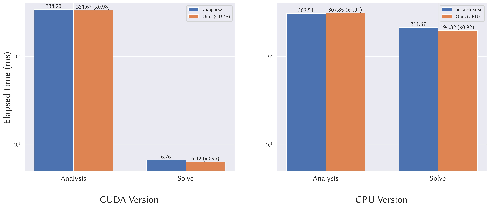

# What is this repo?

This is a minimalistic, self-contained sparse Cholesky solver, supporting
solving both on the CPU and on the GPU, easily integrable in your tensor
pipeline.

Under the hood, it relies on CHOLMOD for sparse matrix factorization. For the
solving phase, it uses CHOLMOD for the CPU version, and uses the result of an
analysis step run *once* when building the solver for fast solving on the GPU
[[1]](#references).

It achieves comparrable performance as other frameworks, with the dependencies
nicely shipped along.



The Python bindings are generated with
[nanobind](https://github.com/wjakob/nanobind), which makes it easily
interoperable with most tensor frameworks (Numpy, PyTorch, JAX...)

# Installing

```bash
pip install cholespy
```

# Documentation

There is only one class in the module, with two variants: `CholeskySolverF,
CholeskySolverD`. The only difference is that `CholeskySolverF` solves the
system in single precision while `CholeskySolverD` uses double precision. This
is mostly useful for solving on the GPU, as the CPU version relies on CHOLMOD,
which only supports double precision anyway.

The most common tensor frameworks (PyTorch, NumPy, TensorFlow...) are supported
out of the box. You can pass them directly to the module without any need for
manual conversion.

Since both variants have the same signature, we only detail `CholeskySolverF`
below:

**`cholespy.CholeskySolverF(n_rows, ii, jj, x, type)`**

**Parameters:**
- `n_rows` - The number of rows in the (sparse) matrix.
- `ii` - The first array of indices in the sparse matrix representation. If
  `type` is `COO`, then this is the array of row indices. If it is `CSC` (resp.
  `CSR`), then it is the array of column (resp. row) indices, such that row
  (resp. column) indices for column (resp. row) `k` are stored in
  `jj[ii[k]:ii[k+1]]` and the corresponding entries are in `x[ii[k]:ii[k+1]]`.
- `jj` - The second array of indices in the sparse matrix representation. If
  `type` is `COO`, then this is the array of column indices. If it is `CSC`
  (resp. `CSR`), then it is the array of row (resp. column) indices.
- `x` - The array of nonzero entries.
- `type` - The matrix representation type, of type `MatrixType`. Available types
  are `MatrixType.COO`, `MatrixType.CSC` and `MatrixType.CSR`.

**`cholespy.CholeskySolverF.solve(b, x)`**

**Parameters**
- `b` - Right-hand side of the equation to solve. Can be a vector or a matrix.
  If it is a matrix, it must be of shape `(n_rows, n_rhs)`. It must be on the
  same device as the tensors passed to the solver constructor. If using CUDA
  arrays, then the maximum supported value for `n_rhs` is `128`.
- `x` - Placeholder for the solution. It must be on the same device and have the
  same shape as `b`.

# Example usage

```python
from cholespy import CholeskySolverF, MatrixType
import torch

# Identity matrix
n_rows = 20
rows = torch.arange(n_rows, device='cuda')
cols = torch.arange(n_rows, device='cuda')
data = torch.ones(n_rows, device='cuda')

solver = CholeskySolverF(n_rows, rows, cols, data, MatrixType.COO)

b = torch.ones(n_rows, device='cuda')
x = torch.zeros_like(b)

solver.solve(b, x)
# b = [1, ..., 1]
```

# References

[1] Naumov, M. (2011). Parallel solution of sparse triangular linear systems in the preconditioned iterative methods on the GPU. NVIDIA Corp., Westford, MA, USA, Tech. Rep. NVR-2011, 1.